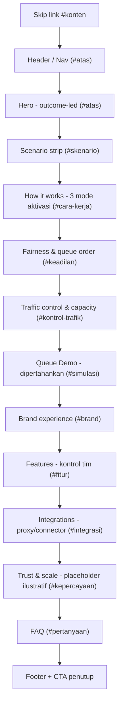

# Design Document

## Overview

Redesign ini menyusun ulang halaman pemasaran Antosan (`src/LandingPage.jsx`) agar berorientasi hasil (outcome-led) dan menonjolkan kepercayaan (trust-forward), sejalan dengan cara produk acuan (Queue-it, Cloudflare Waiting Room) memposisikan diri. Fokusnya adalah penataan ulang struktur bagian, penajaman pesan nilai, penambahan bagian skenario, keadilan, kontrol trafik, dan kepercayaan - sambil **mempertahankan** simulasi antrean interaktif yang sudah diperbaiki beserta aksesibilitas dan kontrak fungsi yang diekspor.

### Tujuan

- Menyampaikan hasil bisnis dalam hitungan detik pada Hero (situs tetap hidup, arus terkendali, giliran adil, pendapatan terlindungi).
- Membantu calon pelanggan mengenali situasinya sendiri melalui skenario konkret dan penjelasan cara kerja, keadilan, serta kontrol trafik.
- Membangun kepercayaan melalui bagian bukti sosial/skala yang jujur menandai angka sebagai ilustratif.
- Menjaga konsistensi visual melalui Design_Token dan pola penamaan `lp-*`.

### Batasan (Constraints)

| Batasan | Sumber | Konsekuensi Desain |
| --- | --- | --- |
| React + Vite, build statis | Req 12.9, Introduction | Semua konten statis; tidak ada backend/API baru. |
| Salinan bahasa Indonesia, brand "Antosan" | Req 1.4, 2.4, 3.5, 4.4, 5.5, 7.3, 10.4, 11.4, 12.10 | Semua string komponen dan data berbahasa Indonesia; istilah teknis (FIFO, reverse proxy, edge connector, custom HTML) tetap dalam bentuk aslinya bila lazim. |
| Tanpa dependensi runtime berat baru | Req 12.9 | Hanya React, `Icon.jsx`, `Mark.jsx`, `siteConfig.js` yang sudah ada. Tidak menambah library animasi/UI. |
| WCAG 2.1 AA (yang dapat diverifikasi otomatis) | Req 12.6 | Skip link, landmark, hierarki heading, keyboard operability, `aria-live`, kontras token. Validasi penuh butuh uji manual. |
| Pertahankan Exported_Contract | Req 13.1, 13.2 | `computeDemoState`, `faqs`, `demoReleaseInstruction`, `demoEmptyQueuePrompt` tetap diekspor dengan tanda tangan & makna sama. |
| Tes yang ada tetap lolos | Req 13.4 | `setup.test.js`, `bugCondition.test.js`, `preservation.test.js`, `phrasing.test.js`, `demoModel.test.js` harus tetap hijau. |
| Build berhasil | Req 13.3 | `npm run build` tanpa galat. |

### Peta Ringkas Requirement → Elemen Desain

Requirement 1 → Hero. 2 → Scenario strip. 3 → How it works (tiga mode aktivasi). 4 → Fairness & queue order. 5 → Traffic control & capacity. 6 → Queue Demo (dipertahankan). 7 → Brand experience. 8 → Features. 9 → Integrations. 10 → Trust & scale. 11 → FAQ. 12 → Navigation, Footer, responsif, aksesibilitas, token. 13 → Non-regresi kontrak & build. (Tabel lengkap ada di bagian akhir dokumen.)

## Architecture

### Keputusan: satu file dengan subkomponen

`LandingPage.jsx` saat ini adalah satu file dengan subkomponen internal (`Brand`, `QueueDemo`, `Integrations`) dan default export `LandingPage`. Redesign **tetap menggunakan pola ini**: satu file `src/LandingPage.jsx` dengan subkomponen per-bagian.

**Alasan:**

- **Kontrak ekspor tetap dari satu modul.** `computeDemoState`, `faqs`, `demoReleaseInstruction`, `demoEmptyQueuePrompt` diimpor oleh lima berkas tes dari `./LandingPage.jsx`. Memecah file berisiko memindahkan ekspor dan merusak jalur impor tes (Req 13.1).
- **Konsisten dengan konvensi yang ada** dan menghindari perubahan struktural yang tidak diminta.
- **Halaman statis kecil.** Tidak ada kebutuhan lazy-loading/route-splitting yang membenarkan pemecahan file.

Data konten statis (array/obyek) didefinisikan di scope modul, di atas komponen yang memakainya, mengikuti pola `trafficLevels`, `integrations`, dan `faqs` yang sudah ada.

### Urutan Bagian (top-to-bottom)

| # | Bagian | Komponen | Section_Anchor | Status | Requirement |
| --- | --- | --- | --- | --- | --- |
| 0 | Skip link | `LandingPage` | `#konten` (target) | Dipertahankan | 12.4 |
| 1 | Header / Nav | `Header` (inline) + `Brand` | - (target `#atas`) | Direfresh | 12.1, 12.2, 12.5 |
| 2 | Hero (outcome-led) | `Hero` | `#atas` | Direfresh | 1 |
| 3 | Scenario strip | `Scenarios` | `#skenario` | Direfresh (diperluas) | 2 |
| 4 | How it works (3 mode) | `HowItWorks` | `#cara-kerja` | Direfresh (diperluas) | 3 |
| 5 | Fairness & queue order | `Fairness` | `#keadilan` | **Baru** | 4 |
| 6 | Traffic control & capacity | `TrafficControl` | `#kontrol-trafik` | **Baru** | 5 |
| 7 | Interactive Queue Demo | `QueueDemo` | `#simulasi` | **Dipertahankan** | 6 |
| 8 | Brand experience | `BrandExperience` | `#brand` | **Baru** | 7 |
| 9 | Features (kontrol tim) | `Features` | `#fitur` | Direfresh | 8 |
| 10 | Integrations | `Integrations` | `#integrasi` | Dipertahankan (diperluas) | 9 |
| 11 | Trust & scale | `Trust` | `#kepercayaan` | **Baru** | 10 |
| 12 | FAQ | `Faq` | `#pertanyaan` | Dipertahankan | 11 |
| 13 | Footer | `Footer` (inline) + `Brand` | - | Direfresh | 12.3 |

**Catatan penempatan Queue Demo.** Saat ini `QueueDemo` berada di dalam Hero. Redesign memindahkannya menjadi bagian tersendiri (`#simulasi`) setelah Traffic Control, sehingga simulasi mengikuti penjelasan kapasitas/laju keluar secara naratif. Sesuai Req 6.6, pemindahan posisi ini **tidak boleh mengubah** perilaku maupun aksesibilitas demo; model `computeDemoState`, handler pelepasan, `aria-live`, dan string yang diekspor tetap identik. Hero kemudian menampilkan visual pendukung ringan (bukan demo interaktif) atau tautan "Coba simulasi" ke `#simulasi`.

### Diagram Alur Bagian



### Struktur Landmark Global

`div.landing-page#atas` → skip link → `header.lp-header` (nav utama + nav seluler) → `main#konten[tabindex=-1]` (semua `section`) → `footer.lp-footer`.

## Components and Interfaces

Sebagian besar komponen bersifat statis (menerima data dari scope modul, tanpa props/state). Hanya `QueueDemo`, `Integrations`, dan bagian interaktif Navigation dan How-it-works yang memiliki state. Setiap `section` memakai `aria-labelledby` menunjuk ke heading-nya.

### Header / Nav (inline di `LandingPage`)

- **Tujuan:** navigasi ke Section_Anchor bagian utama + Primary_CTA nav; menu seluler.
- **State:** `menuOpen` (boolean), `menuButtonRef`.
- **Perilaku:** tombol `.lp-menu-toggle` dengan `aria-expanded`/`aria-controls`; `Escape` menutup menu dan mengembalikan fokus ke tombol; `onBlur` menutup menu saat fokus keluar header; klik tautan di nav seluler menutup menu (Req 12.2). Pola ini **dipertahankan** dari implementasi saat ini.
- **navLinks (diperbarui):** Cara kerja (`#cara-kerja`), Keadilan (`#keadilan`), Kontrol trafik (`#kontrol-trafik`) - opsional untuk menjaga nav ringkas, Fitur (`#fitur`), Integrasi (`#integrasi`), FAQ (`#pertanyaan`). Nav desktop dan seluler memakai fragment `navLinks` yang sama (Req 12.2). Jumlah tautan dijaga ringkas; anchor sekunder tetap dapat dijangkau lewat scroll.

### Hero (`Hero`)

- **Tujuan:** proposisi nilai berorientasi hasil (Req 1).
- **Props/State:** statis.
- **Struktur/ARIA:** `section.lp-hero` `aria-labelledby="hero-title"`; `h1#hero-title`; deskripsi yang menyebut keempat hasil (akses saat lonjakan, kendali arus masuk, giliran adil, pendapatan terlindungi - Req 1.1); tepat satu `a.lp-button` (Primary_CTA) `href={siteConfig.dashboardUrl}` label `siteConfig.dashboardLabel` (Req 1.2); tepat satu `a.lp-secondary-link` `href="#cara-kerja"` (Req 1.3).
- **Anchor:** `#atas` (di root page).

### Scenarios (`Scenarios`)

- **Tujuan:** minimal empat skenario + skenario musiman, masing-masing dengan pernyataan hasil (Req 2).
- **Data:** `scenarios[]` (lihat Data Models). Render `ul` skenario; setiap item menampilkan label + kalimat hasil singkat.
- **Anchor:** `#skenario`.

### HowItWorks (`HowItWorks`)

- **Tujuan:** alur pengunjung (kedatangan → ruang tunggu → masuk) dan tiga mode aktivasi (Req 3).
- **Struktur:** intro + `ol.lp-steps` (tiga langkah alur, dipertahankan) + blok tiga mode aktivasi.
- **Mode aktivasi sebagai tabs/accordion accessible.** Tiga mode (`plays[]`) ditampilkan sebagai daftar. Bila diinteraktifkan sebagai tab, gunakan **pola tablist yang sama** dengan `Integrations` (role `tablist`/`tab`/`tabpanel`, `aria-selected`, `tabIndex` roving, navigasi Arrow/Home/End). Alternatif yang lebih sederhana dan tetap aksesibel: `<details>`/`<summary>` accordion (native keyboard). **Keputusan:** gunakan daftar statis `<article>` per mode (tanpa state) untuk memenuhi Req 3.2–3.3 tanpa menambah kompleksitas interaktif; setiap mode menyatakan "kapan digunakan". Ini menjaga aksesibilitas by default dan tidak membebani bundel. (Jika reviewer menginginkan tab, lihat pola aksesibel di `Integrations`.)
- **Anchor:** `#cara-kerja` (dirujuk Navigation, Req 3.4).

### Fairness (`Fairness`) - baru

- **Tujuan:** urutan FIFO, pengacakan pre-queue untuk mulai terjadwal, dan pengurangan keuntungan bot (Req 4).
- **Data:** `fairnessPoints[]`. Render heading + daftar poin.
- **Batasan copy:** tidak mengklaim pemblokiran bot mutlak (Req 4.4) - frasa seperti "mengurangi keuntungan tidak adil dari bot", bukan "memblokir semua bot".
- **Anchor:** `#keadilan`.

### TrafficControl (`TrafficControl`) - baru

- **Tujuan:** kapasitas & laju keluar (pengunjung/menit), penyesuaian laju saat event berlangsung, cakupan proteksi (seluruh situs/path/aksi dinamis), dan pilihan antrean selalu-tampil vs saat-puncak (Req 5).
- **Data:** `trafficControlPoints[]`.
- **Anchor:** `#kontrol-trafik`.

### QueueDemo (`QueueDemo`) - dipertahankan (Req 6, 13)

Perilaku dan kontrak **tidak berubah**. Hanya penempatan/pembungkus visual yang dapat berubah (Req 6.6).

- **State:** `level` (index `trafficLevels`), `released`.
- **Model:** `computeDemoState({ visitors, released, capacity })` → `{ visitors, released, capacity, remaining, active, queued }`, dengan `capacity = 8`. Formula dipertahankan persis:
  - `queued = max(0, visitors - capacity - released)`
  - `active = min(capacity, visitors - queued)`
  - `remaining = queued`
- **Handler pelepasan:** `setReleased((value) => value + Math.min(4, queued))` - memasukkan hingga 4 pengunjung dan menurunkan `queued` sesuai jumlah yang dimasukkan (Req 6.2).
- **Ganti tingkat:** `changeLevel(index)` → `setLevel(index)` + `setReleased(0)`, menghitung ulang antrean dari total pengunjung tingkat baru (Req 6.4).
- **Disabled saat kosong:** tombol pelepasan `disabled={queued === 0}`; saat `queued === 0` menampilkan `demoEmptyQueuePrompt`, jika `queued > 0` menampilkan `demoReleaseInstruction` (Req 6.3).
- **ARIA:** `figure` `aria-labelledby="demo-title"`; blok metrik memakai `aria-live="polite" aria-atomic="true"` (Req 6.5); visual aliran `aria-hidden="true"`.
- **String yang dilestarikan:** `demoReleaseInstruction = "Loloskan 4 pengunjung ke dalam situs."`, `demoEmptyQueuePrompt = "Ubah trafik untuk mencoba lagi."` (Req 13.2). Ketiga string status line juga dipertahankan.
- **Anchor:** `#simulasi`.

### BrandExperience (`BrandExperience`) - baru

- **Tujuan:** halaman antrean dapat di-brand via custom HTML, tetap menampilkan posisi antrean & estimasi waktu tunggu (Req 7).
- **Data:** copy statis (dapat memakai `brandExperience` obyek kecil bila perlu).
- **Anchor:** `#brand`.

### Features (`Features`) - direfresh

- **Tujuan:** kontrol untuk tim: penjadwalan pre-queue dengan hitung mundur, pemantauan real-time (pengunjung aktif, panjang antrean, estimasi waktu tunggu), custom HTML, peran tim & pemisahan room (Req 8.1–8.4).
- **Data:** `features[]` (`dt`/`dd`).
- **Tautan:** `a.lp-dark-link` `href={siteConfig.dashboardUrl}` label `siteConfig.dashboardFeatureLabel` (Req 8.5).
- **Anchor:** `#fitur` (Req 8.6).

### Integrations (`Integrations`) - dipertahankan (Req 9)

- **State:** `mode` (`"proxy"` | `"connector"`), `tabs` (ref array).
- **Pola tab keyboard-accessible dipertahankan:** `role="tablist"` + tombol `role="tab"` dengan `id`, `aria-selected`, `aria-controls`, `tabIndex` roving; `onTabKey` menangani ArrowLeft/ArrowRight/Home/End dan memindahkan fokus (Req 9.4). Panel `role="tabpanel"` dengan `hidden` dan `aria-labelledby`.
- **Perluasan copy:** menyebut jangkauan connector yang lebih luas (sisi klien, sisi server, edge, seluler) pada detail mode connector (Req 9.3). Dua mode (reverse proxy, edge connector) dipertahankan (Req 9.1); memilih mode menampilkan deskripsi & alur sesuai (Req 9.2).
- **Anchor:** `#integrasi`.

### Trust (`Trust`) - baru

- **Tujuan:** minimal satu kutipan testimoni + atribusi, dan pernyataan keandalan/skala (Req 10).
- **Data:** `trustQuote` (dengan flag `illustrative: true`) dan `trustStats[]`.
- **Penandaan ilustratif:** karena angka & atribusi bukan data pelanggan nyata, bagian ini menampilkan penanda terlihat (mis. label "Ilustrasi" / catatan) sehingga tidak tampil sebagai klaim nyata (Req 10.3). Menggunakan panel gelap `--story-*` untuk band kutipan.
- **Anchor:** `#kepercayaan`.

### Faq (`Faq`) - dipertahankan (Req 11)

- **Data:** `faqs` (array pasangan `[pertanyaan, jawaban]`, **kontrak dipertahankan** untuk `phrasing.test.js`).
- **Struktur:** `details`/`summary` per entri (native keyboard-accessible).
- **Anchor:** `#pertanyaan`.

### Footer (inline)

- CTA penutup `a.lp-button` `href={siteConfig.dashboardUrl}` (Req 12.3); `Brand`; tautan "Kembali ke atas" (`#atas`).

## Data Models

Seluruh data konten statis didefinisikan pada scope modul `LandingPage.jsx`. Bentuk (shape) di bawah adalah kontrak internal untuk komponen; hanya `faqs` yang merupakan Exported_Contract dan wajib menjaga bentuk larik pasangan.

```js
// Dipertahankan persis (Req 6, 13):
const trafficLevels = [
  { label: "Normal", visitors: 6 },
  { label: "Ramai", visitors: 18 },
  { label: "Lonjakan", visitors: 30 },
];
const capacity = 8;

export const demoReleaseInstruction = "Loloskan 4 pengunjung ke dalam situs.";
export const demoEmptyQueuePrompt = "Ubah trafik untuk mencoba lagi.";

// Scenario_Section (Req 2): >= 4 skenario dasar + skenario musiman.
// { id, label, outcome } - outcome = pernyataan hasil singkat (Req 2.3).
const scenarios = [
  { id: "tiket",     label: "Penjualan tiket",   outcome: "…" },
  { id: "flashsale", label: "Flash sale",         outcome: "…" },
  { id: "registrasi",label: "Registrasi event",   outcome: "…" },
  { id: "peluncuran",label: "Peluncuran produk",  outcome: "…" },
  { id: "musiman",   label: "Puncak musiman",     outcome: "…", seasonal: true }, // Req 2.2
];

// How_It_Works (Req 3.2, 3.3): tepat tiga mode aktivasi.
// { id, title, description, when } - when = kapan sebaiknya digunakan (Req 3.3).
const plays = [
  { id: "jaring-pengaman", title: "Jaring pengaman", description: "…", when: "…" }, // aktif saat trafik lampaui ambang
  { id: "terjadwal",       title: "Pelepasan terjadwal", description: "…", when: "…" }, // hitung mundur sebelum gerbang dibuka
  { id: "eksklusif",       title: "Akses eksklusif", description: "…", when: "…" }, // undangan/tautan unik
];

// Fairness (Req 4): { id, title, body }
const fairnessPoints = [
  { id: "fifo",       title: "Urutan FIFO",            body: "Mendahulukan pengunjung yang datang lebih awal." },
  { id: "acak",       title: "Pengacakan pre-queue",   body: "Untuk event dengan mulai terjadwal." },
  { id: "bot",        title: "Lebih adil terhadap bot",body: "Mengurangi keuntungan tidak adil dari bot." }, // tanpa klaim absolut (Req 4.4)
];

// TrafficControl (Req 5): { id, title, body }
const trafficControlPoints = [
  { id: "kapasitas", title: "Kapasitas & laju keluar", body: "… pengunjung per menit." },     // Req 5.1
  { id: "penyesuaian", title: "Sesuaikan saat berjalan", body: "…" },                          // Req 5.2
  { id: "cakupan",   title: "Cakupan proteksi",         body: "Seluruh situs, path, atau aksi dinamis." }, // Req 5.3
  { id: "tampil",    title: "Mode tampil antrean",      body: "Selalu tampil atau hanya saat puncak." },   // Req 5.4
];

// Features (Req 8): { term, detail } → <dt>/<dd>
const features = [
  { term: "Jadwalkan momen pembukaan.",   detail: "…" }, // pre-queue + hitung mundur (8.1)
  { term: "Pantau situasi saat itu juga.",detail: "…" }, // real-time monitoring (8.2)
  { term: "Ruang tunggu, identitas Anda.",detail: "…" }, // custom HTML (8.3)
  { term: "Atur akses bersama tim.",      detail: "…" }, // peran tim + room (8.4)
];

// Integrations (Req 9): dipertahankan, detail connector diperluas (9.3).
const integrations = {
  proxy:     { title, description, path: [...], details: [...] },
  connector: { title, description, path: [...], details: [...] }, // sebut klien/server/edge/seluler
};

// Trust (Req 10): angka & atribusi ilustratif (Req 10.3).
const trustQuote = {
  quote: "…",
  author: "…",           // atribusi ilustratif
  role: "…",
  illustrative: true,    // penanda mesin; UI menampilkan penanda terlihat
};
const trustStats = [
  { value: "…", label: "…", illustrative: true }, // pernyataan keandalan/skala (Req 10.2)
];

// FAQ (Req 11): Exported_Contract - larik pasangan [pertanyaan, jawaban].
export const faqs = [
  ["…", "…"],
  // … (isi dipertahankan, termasuk jawaban "administrator workspace"/"anggota tim"
  //    yang diuji phrasing.test.js)
];
```

**Catatan bentuk:**

- `faqs` **wajib** tetap berupa `Array<[string, string]>` (Req 11.2) agar `phrasing.test.js` (yang melakukan `faqs.find(([q]) => …)`) tetap valid. Jawaban FAQ "Bagaimana cara mendapatkan akses?" harus tetap memuat "administrator workspace" dan "anggota tim" serta tidak memuat "administrator platform".
- Angka pada `trustQuote`/`trustStats` adalah **Illustrative_Placeholder** - bukan klaim pelanggan nyata (Out of Scope & Req 10.3).
- `scenarios`/`plays`/`features`/`fairnessPoints`/`trafficControlPoints` adalah data internal; komponennya me-map atasnya untuk render.

## Correctness Properties

*Sebuah properti adalah karakteristik atau perilaku yang harus selalu benar pada semua eksekusi valid dari sistem - pada dasarnya pernyataan formal tentang apa yang harus dilakukan sistem. Properti menjembatani spesifikasi yang dapat dibaca manusia dengan jaminan kebenaran yang dapat diverifikasi mesin.*

Bagian ini mencakup satu-satunya area feature dengan logika yang bervariasi terhadap input: model murni `computeDemoState` dan handler pelepasan pada Queue_Demo. Konten statis lain (copy, struktur bagian, tab, layout) diverifikasi lewat uji contoh/DOM (lihat Testing Strategy), bukan property-based test.

Handler pelepasan dimodelkan persis seperti komponen: `released → released + Math.min(4, queued)`, lalu `computeDemoState` dijalankan ulang untuk memperoleh keadaan "sesudah". `capacity = 8`. Domain input: `visitors ∈ {6, 18, 30}` (tingkat trafik), `released ∈ [0, N]`.

### Property 1: Batas model selalu terjaga

*Untuk semua* tingkat trafik dan nilai `released` yang valid, hasil `computeDemoState` memenuhi `active ≤ capacity` dan `queued ≥ 0`, serta `remaining === queued` (tidak ada pengunjung yang "hilang" dari simulasi).

**Validates: Requirements 6.1, 6.6**

### Property 2: Pelepasan memasukkan pengunjung antrean

*Untuk semua* input dengan `queued > 0`, satu kali pelepasan menghasilkan `queued → max(0, queued − 4)` (turun sebesar `min(4, queued)`), `active` tetap terpancang pada `capacity` selama antrean masih tersisa, dan populasi hadir (`visitors`) tidak berubah.

**Validates: Requirements 6.2, 6.6**

### Property 3: Tombol pelepasan nonaktif tepat saat antrean kosong

*Untuk semua* input, keadaan nonaktif tombol pelepasan sama dengan `queued === 0`; saat `queued === 0`, prompt yang ditampilkan adalah `demoEmptyQueuePrompt`.

**Validates: Requirements 6.3**

### Property 4: Ganti tingkat mereset dan menghitung ulang

*Untuk semua* tingkat trafik, keadaan dengan `released = 0` (hasil dari penggantian tingkat) menghasilkan `queued === max(0, visitors − capacity)` dan `released === 0`.

**Validates: Requirements 6.4**

## Error Handling

- **`siteConfig.dashboardUrl` tidak dikonfigurasi saat build.** `siteConfig` sudah menyediakan fallback: `dashboardUrl || "#simulasi"` dan label alternatif ("Coba simulasi", "Simulasi", dst.). Semua CTA (Hero, Features, Footer) memakai nilai dari `siteConfig`, sehingga tidak pernah menghasilkan `href` kosong (Req 1.5). Desain tidak mengubah mekanisme env Vite ini.
- **Antrean kosong / banyak pelepasan.** Tombol pelepasan `disabled` saat `queued === 0`; `Math.min(4, queued)` menjadikan pelepasan no-op saat kosong, dan `Math.max(0, …)` mencegah `queued` negatif meski ditekan berulang (Property 1–3).
- **Copy panjang / pembungkusan teks.** Heading memakai `overflow-wrap: anywhere`, `min-width: 0`, dan `text-wrap: balance` (sudah ada di `landing.css`); data konten dijaga ringkas agar tidak merusak tata letak pada layar sempit.
- **Tanpa JavaScript.** `index.html` menyertakan `<noscript>` berbahasa Indonesia yang menjelaskan produk dan meminta mengaktifkan JS. Konten inti tetap dapat dipahami dari meta description.
- **Connector docs URL tidak dikonfigurasi.** `siteConfig.connectorDocsUrl` memiliki fallback ke panduan repo; label memakai "Panduan integrasi".

## Testing Strategy

### Pendekatan ganda

- **Property-based test** untuk properti universal model `computeDemoState` (Property 1–4) - sudah ada dan **wajib dipertahankan hijau**.
- **Unit/DOM/example test** untuk konten statis, struktur bagian, wiring ARIA, dan interaksi (tab, menu seluler).

### Tes yang wajib tetap lolos (Req 13.4)

| Berkas | Cakupan | Kontrak yang dijaga |
| --- | --- | --- |
| `setup.test.js` | Snapshot `computeDemoState` untuk level Normal | Bentuk `{ visitors, released, capacity, remaining, active, queued }` |
| `bugCondition.test.js` | Property 1/2: pelepasan memasukkan antrean, `active` terpancang, `remaining === queued` | Req 6.1, 6.2 |
| `preservation.test.js` | Perilaku observable (disabled iff `queued===0`, reset level, status line) | Req 6.1–6.4 |
| `demoModel.test.js` | Unit + property nilai turunan, handler pelepasan, status line | Req 6.1–6.4 |
| `phrasing.test.js` | String demo & jawaban FAQ | Req 11.2, 13.1, 13.2 |

Semua tes mengimpor dari `./LandingPage.jsx`, sehingga selama Exported_Contract dan model dipertahankan, tes tetap hijau tanpa modifikasi.

### Konfigurasi property-based test

- Library: **fast-check** (sudah dipakai; tidak menambah dependensi berat - Req 12.9).
- Minimal 100 iterasi per property test (default fast-check `numRuns = 100`).
- Setiap property test menyertakan komentar tag yang merujuk properti desain.
  - Format tag: `Feature: landing-page-redesign, Property {number}: {property_text}`

### Tes baru yang ringan (opsional, example/DOM) untuk konten baru

- **Scenarios:** `scenarios.length >= 5`, memuat label wajib (tiket, flash sale, registrasi event, peluncuran produk) dan satu entri `seasonal: true`; setiap entri punya `outcome` non-kosong (Req 2.1–2.3).
- **HowItWorks:** `plays.length === 3` dengan id `jaring-pengaman`/`terjadwal`/`eksklusif`; setiap `play` punya `when` non-kosong (Req 3.2–3.3).
- **Trust:** `trustQuote.illustrative === true` dan penanda "Ilustrasi" ter-render (Req 10.3).
- **CTA:** Primary_CTA & Footer CTA `href === siteConfig.dashboardUrl` dan tidak kosong; Features link label `=== siteConfig.dashboardFeatureLabel` (Req 1.2, 1.5, 8.5, 12.3).
- **Integrations (DOM):** klik/keyboard tab menampilkan panel yang cocok, lainnya `hidden`; roles `tablist`/`tab`/`tabpanel` ada (Req 9.2, 9.4).
- **Nav seluler (DOM):** toggle membuka/menutup; klik tautan menutup menu (Req 12.2).

Tes DOM baru dapat memakai `@testing-library/react` bila sudah tersedia; jika belum, cukup uji struktur data statis (`scenarios`, `plays`, `trustQuote`) sebagai ekspor internal atau lewat pemeriksaan render minimal - tanpa menambah dependensi berat.

### Build & aksesibilitas

- **Build:** `npm run build` harus berhasil tanpa galat (Req 13.3).
- **Uji:** `npm test` harus lolos seluruhnya (Req 13.4).
- **WCAG:** kriteria yang dapat diverifikasi otomatis (landmark, `aria-live`, keyboard tab/menu, skip link, kontras token) ditargetkan. **Validasi WCAG 2.1 AA penuh memerlukan pengujian manual dengan teknologi bantu dan tinjauan ahli aksesibilitas** (Req 12.6, Out of Scope).

## Visual & Design-Token Strategy

- **Token warna & permukaan:** memakai `--panel`, `--ink`, `--line`, `--accent`, `--accent-deep`, `--accent-ink`, `--info`, `--success` dari `tokens.css`; dukungan light/dark otomatis via `prefers-color-scheme` yang sudah didefinisikan (Req 12.8).
- **Skala spasi:** memakai `--space-1..--space-16` untuk padding/margin antar-elemen, dan `--lp-section-gap` untuk jarak antarbagian.
- **Radius & easing:** `--radius`, `--radius-sm`, `--ease-out`, `--dur-short` untuk sudut dan umpan balik interaksi (kontrol saja; hormati reduced-motion).
- **Band kepercayaan gelap:** Trust memakai palet `--story-bg`, `--story-ink`, `--story-muted`, `--story-line` untuk panel kutipan gelap yang kontras.
- **Penamaan kelas:** mengikuti konvensi `lp-*` (mis. `lp-scenarios`, `lp-fairness`, `lp-traffic-control`, `lp-brand-experience`, `lp-trust`, `lp-trust-quote`, `lp-illustrative`).
- **Responsif:** kontainer `.lp-container` (`min(100%, 1320px)`), gutter `--lp-page-gutter` berbasis `clamp()`, dan grid/flow yang menyusut ke satu kolom pada layar seluler (Req 12.7). Menu seluler untuk viewport sempit sudah ada.

### Color_Palette Berorientasi Cloudflare (Req 14)

Color_Palette **diubah** ke arahan Cloudflare - oranye hangat sebagai accent dipadukan netral hangat - melalui **pembaruan token warna di `src/tokens.css` SAJA**. Karena `landing.css` sudah mengonsumsi warna lewat `var(--token)`, perubahan warna dapat dipusatkan di `tokens.css` tanpa mengubah pemakaian `var(--...)` maupun markup di `landing.css` (Req 14.7). Ini menggantikan pendekatan sebelumnya yang mempertahankan palette apa adanya / "tidak menambah token baru": nilai token yang ada diperbarui, bukan token baru ditambahkan.

**Token warna light (diperbarui di `tokens.css`):**

| Token | Nilai baru | Peran |
| --- | --- | --- |
| `--accent` | `#f6821f` | Oranye hangat (accent utama) |
| `--accent-deep` | `#d5680a` | Aksen lebih pekat (hover/fokus) |
| `--accent-ink` | `#ffffff` | Teks/ikon di atas `--accent` |
| `--ink` | `#1d1f20` | Teks utama |
| `--line` | `#e6e6e9` | Garis/pembatas netral |
| `--input-line` | `#9b9ba3` | Garis input |
| `--lp-secondary-ink` | `#5b5b62` | Teks sekunder (lihat catatan lokasi di bawah) |
| `--info` | `#0b73c7` | Tautan informasional |

**Token warna dark (diperbarui di `tokens.css`):**

| Token | Nilai baru | Peran |
| --- | --- | --- |
| `--accent` | `#ff9147` | Oranye hangat versi terang untuk latar gelap |
| `--accent-deep` | `#ffa869` | Aksen lebih terang (hover/fokus) |
| `--accent-ink` | `#1e2227` | Teks/ikon gelap di atas `--accent` |
| `--panel` (dan netral gelap lain) | `#20262e` (dipertahankan) | Netral gelap dipertahankan mendekati nilai saat ini |

**Dipertahankan tanpa perubahan (Req 14.5):**

| Token | Alasan |
| --- | --- |
| `--dot-blue`, `--dot-cyan`, `--dot-purple`, `--dot-pink` | Warna brand mark (dots) tetap sama |
| `--story-bg`, `--story-ink`, `--story-muted`, `--story-line` | Band gelap Trust tetap kontras dan konsisten |

Karena `landing.css` mengonsumsi token, perubahan warna terpusat di `tokens.css`; band Trust tetap memakai `--story-*` sehingga tidak terpengaruh pergeseran accent.

- **Catatan lokasi `--lp-secondary-ink`:** token ini saat ini **didefinisikan di `landing.css`** (untuk light maupun dark), bukan di `tokens.css`. Karena termasuk bagian dari perubahan Color_Palette, nilainya perlu ikut disesuaikan - namun pembaruannya dilakukan **di `landing.css`** sesuai lokasi definisinya saat ini (bukan dipindah atau didefinisikan ulang di `tokens.css`). Ini pengecualian lokasi yang disengaja terhadap aturan "token warna hanya di `tokens.css`", karena definisinya memang berada di `landing.css`.

## Accessibility Design

- **Skip link:** `a.lp-skip` `href="#konten"` (Req 12.4), target `main#konten[tabindex=-1]`.
- **Landmark semantik:** `header` + `nav[aria-label]`, `main`, `footer`; setiap `section` `aria-labelledby` ke heading-nya (Req 12.5).
- **Hierarki heading:** satu `h1` (Hero), `h2` per bagian, `h3` untuk sub-item (langkah, mode, panel integrasi). Tidak melompati level.
- **Keyboard operability:**
  - Tab integrasi: roving `tabIndex`, Arrow/Home/End, fokus dipindah ke tab terpilih (dipertahankan).
  - Menu seluler: `aria-expanded`/`aria-controls`, `Escape` menutup + kembalikan fokus, tutup saat tautan diklik.
  - FAQ: `details`/`summary` native.
- **Fokus:** `:focus-visible` outline `--accent-deep` (sudah ada di `landing.css`).
- **`aria-live`:** blok metrik Queue_Demo `aria-live="polite" aria-atomic="true"` (Req 6.5); visual aliran `aria-hidden`.
- **Kontras warna:** memakai pasangan token `--ink`/`--panel` dan `--accent-ink`/`--accent`; band gelap memakai `--story-ink`/`--story-bg`. Menargetkan rasio AA (verifikasi manual untuk kombinasi kustom). Dengan Color_Palette Cloudflare yang baru (Req 14), pasangan accent yang diperbarui - `--accent-ink` di atas `--accent`, serta teks `--ink` di atas `--panel` - dirancang untuk menargetkan WCAG AA; verifikasi kontras penuh tetap memerlukan cek manual (Req 14.6).
- **Reduced motion:** animasi hanya untuk umpan balik kontrol; hormati `prefers-reduced-motion` (nonaktifkan transisi non-esensial).

## SEO / Meta

`index.html` sudah memuat meta description, Open Graph, Twitter Card, dan JSON-LD (`WebSite`) berbahasa Indonesia yang konsisten dengan judul Hero saat ini ("Ramai pengunjung. Tetap terkendali."). Redesign menjaga struktur tag ini **tanpa merestrukturisasi**; hanya menyelaraskan salinan meta/OG/Twitter/JSON-LD agar tetap konsisten dengan copy Hero/bagian yang diperbarui (bahasa Indonesia, brand "Antosan"). `lang="id"`, `og:locale="id_ID"`, dan `inLanguage="id-ID"` dipertahankan.

## Requirements Traceability

| Req | Kriteria inti | Elemen desain |
| --- | --- | --- |
| 1 | Hero berorientasi hasil, 1 Primary_CTA, 1 tautan sekunder, ID, fallback URL | `Hero`, `siteConfig`, Error Handling |
| 2 | ≥4 skenario + musiman, tiap skenario ada hasil, ID | `Scenarios`, `scenarios[]` |
| 3 | Alur + 3 mode aktivasi + kapan digunakan, anchor, ID | `HowItWorks`, `plays[]`, `#cara-kerja` |
| 4 | FIFO, pengacakan pre-queue, keadilan bot (tanpa klaim absolut), ID | `Fairness`, `fairnessPoints[]` |
| 5 | Kapasitas & laju keluar, penyesuaian berjalan, cakupan, mode tampil, ID | `TrafficControl`, `trafficControlPoints[]` |
| 6 | Model `computeDemoState`, pelepasan ≤4, disabled saat kosong, reset level, `aria-live`, tetap terjaga saat dipindah | `QueueDemo`, Property 1–4 |
| 7 | Custom HTML brand, posisi antrean & estimasi, ID | `BrandExperience` |
| 8 | Penjadwalan, pemantauan, custom HTML, peran tim, tautan dashboard, anchor | `Features`, `features[]`, `#fitur` |
| 9 | Dua mode integrasi, deskripsi per mode, jangkauan connector, tab ARIA keyboard, ID | `Integrations`, `integrations{}`, `#integrasi` |
| 10 | Kutipan + atribusi, pernyataan skala, penanda ilustratif, ID | `Trust`, `trustQuote`, `trustStats` |
| 11 | Render tiap `faqs`, kontrak larik pasangan, anchor, ID | `Faq`, `faqs`, `#pertanyaan` |
| 12 | Nav anchor, menu seluler, footer CTA, skip link, landmark, WCAG, responsif, Design_Token & Color_Palette (Req 14), build statis, ID | Header/Footer, Accessibility, Visual & Design-Token Strategy (Color_Palette) |
| 13 | Ekspor kontrak, string demo dipertahankan, build & tes lolos | Exported_Contract, Testing Strategy |
| 14 | Color_Palette Cloudflare (accent oranye/netral, varian dark, dots & `--story-*` dipertahankan, target kontras AA, perubahan di `tokens.css` saja) | `tokens.css` (token warna), Visual & Design-Token Strategy → Color_Palette, Accessibility (kontras) |
